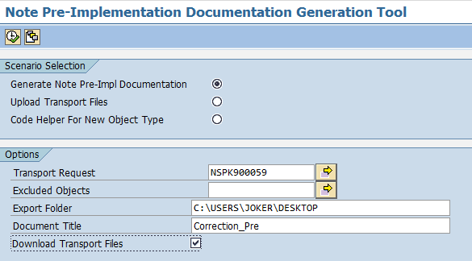
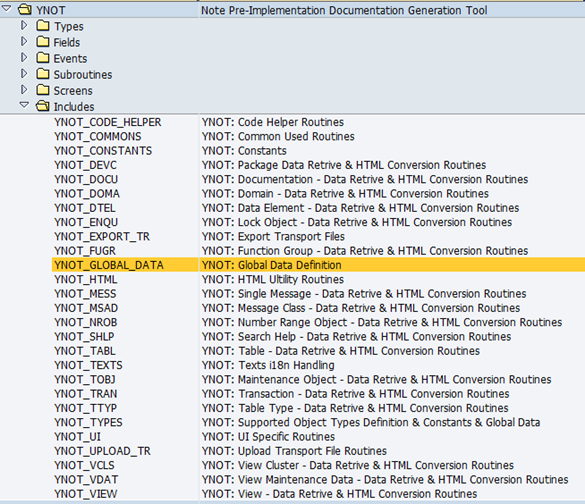
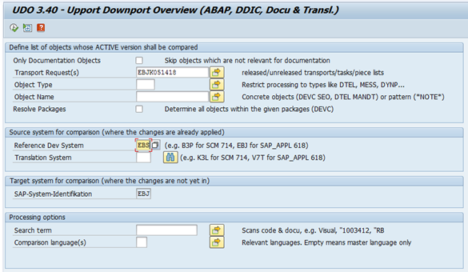

# YNOT: A SAP Note Documentation Generation Tool

## How to use it?
The easiest way to play around with YNOT is to create a program called YNOT, then copy code in _**YNOT_ALL_IN_ONE.abap**_ to it, compile and run, you would see screen like this(I choose classic theme for SAP GUI, which is not that fancy).

You can generate documentation based on a Transport Request, it will also download the request as a zip file, so that you can also choose to upload to another system. If you want to support a new object type, you can click radiobox of "Code Helpet For New Object Type" to generate skeletion of the subroutine you need to implement yourself.

Another way is using [**ZSAPLink**](https://github.com/sapmentors/SAPlink), the popular code exchange tool to import _**NUGG_YNOT.nugg**_, it's more friendly for navigation within all the modules and subroutines within.

_**YNOT_ALL_IN_ONE.abap**_ is generated after each major release, it simply combines dozens of routines together to one single file, for the convenience of those who don't want get their hands dirty with ZSAPLink.

## Why did you create it?
SAP provides patches to customers via [**Note**](https://blogs.sap.com/2013/09/18/sap-oss-notes-an-overview/), there can be source code changes and many other stuff, such as Data Dictionary objects, maintenance views, Function Groups and etc.
Unfortunately, source code changes can be applied automatically to customers' system, while many other kinds of objects not. Customer needs to create these objects themselves manually
according to the documentation SAP developers wrote, also manually, which is painful and inefficiency.

I tried to write implementation manual for customer once, and I don't want to do it again for ever. So before the next Note come, I implement this program in spare time aiming to generate documentation automatically according to a transportation request corresponding to the Note I would deliver.

And it was done after dozens of sleepless night, which I enjoyed much. It worked pretty well and reduce the time from typically 1 hour or more to less than 10 seconds. It supports most frequently used 33 object types.

## Why do you open source here? Will there be some legal issues?
It's a sad story, man. After I finished this program and shared to my teammates, they thought it was kind of good and recommend me to apply CIP(Continuous Improvement) internally.
So I did after my boss reviewed and gave positive feedback. However, when I talked with the CIP committee I found that there is a far better program called **UDO** existing already.

Compared to the features of UDO, YNOT is too simple, sometimes naive...😭I learned a lot from UDO implementation as it chose to generate code, rather than documentation, which reduced workload of both customers and developers. There are some tricks and ideas I got to know for the first time when I read UDO's code carefully, and it was a enjoyable read.

Then I chose to be an evangelist of UDO and buried YNOT. At that time I recommend UDO to developers I know who are struggling with Note delivery work. I didn't realized that I became the Ambassador of UDO at SAP Labs Shanghai FGI team. And I was invited to give advice on certain Note delivery work also.

Basically YNOT was never used in production environment of SAP and I don't think there will be any legal issue against a project that was dead before it was born - at least I hope so.

I open source this program here for those who have interest of ABAP programming, also to record an unforgettable experience at SAP.

## Why did you call this little program 'YNOT'?
According to SAP naming convention, customized program name must start with 'Y' or 'Z'. And I always remember a colleague who said "Why Not?" hundreds of times every day, which made me laugh each time like a fool. To obey the naming convention and honor this remarkable figure I called my program **YNOT**, it also indicates that it's a utility program about SAP Note.

 
